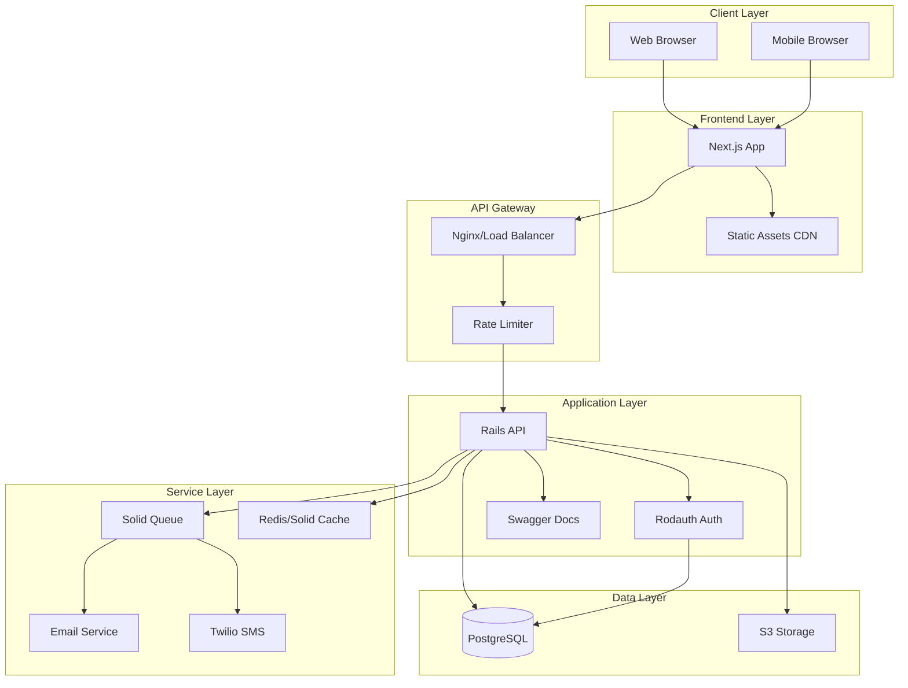

# Portfolio as a Service - Brownfield Enhancement Architecture

## 1. Introduction

Este documento define la arquitectura técnica para la estabilización y preparación para producción del sistema **Portfolio as a Service**. Su objetivo principal es servir como blueprint arquitectónico para la reorganización técnica, consolidación de componentes y resolución de deuda técnica, asegurando la integración fluida con los sistemas existentes.

**Relación con la Arquitectura Existente:**
Este documento complementa y formaliza la arquitectura actual del proyecto, definiendo cómo los componentes existentes serán reorganizados, estandarizados y completados para alcanzar un estado production-ready.

### 1.1 Análisis del Proyecto Existente

#### Estado Actual del Proyecto

- **Propósito Principal:** Plataforma SaaS que permite a usuarios crear y gestionar portfolios profesionales personalizados con URLs únicos
- **Stack Técnico Actual:** 
  - Backend: Rails 8.0.1 con arquitectura API-only
  - Frontend: Next.js separado consumiendo APIs REST
  - Base de Datos: SQLite (desarrollo) con migración planificada a PostgreSQL
- **Estilo Arquitectónico:** Arquitectura distribuida con separación backend/frontend, intención de DDD parcialmente implementada
- **Método de Deployment:** Docker/Kamal (configurado pero no probado)

#### Documentación Disponible

- Más de 120 archivos de documentación en `portfolio-backend/docs/`
- Workbook con 120+ tareas de implementación planificadas
- Documentación de autenticación con múltiples estrategias
- Roadmap fragmentado en 15+ archivos
- Documentación duplicada y desorganizada entre múltiples directorios

#### Restricciones Identificadas

- Pipeline CI/CD de GitHub Actions roto o mal configurado
- Tests ausentes o fallando en todos los niveles
- Autenticación con Rodauth sin testear ni completar
- Documentación dispersa sin estándar unificado
- Falta de gestión de proyecto (stories/tasks no documentadas)
- Deuda técnica significativa en arquitectura y patrones

### 1.2 Registro de Cambios

| Cambio | Fecha | Versión | Descripción | Autor |
|--------|-------|---------|-------------|--------|
| Arquitectura Inicial | 2025-01-19 | 0.1.0 | Documento inicial de arquitectura brownfield | BMad/Angel |

## 2. Alcance de Mejora y Estrategia de Integración

### 2.1 Resumen de la Mejora

**Tipo de Mejora:** Estabilización y Production Readiness
**Alcance:** Sistema completo (Backend + Frontend + Infraestructura)
**Impacto de Integración:** Mayor - Requiere reorganización arquitectónica significativa

### 2.2 Estrategia de Integración

**Estrategia de Integración de Código:** 
- Preservar funcionalidad existente mientras se refactoriza
- Migración incremental a patrones DDD completos
- Estandarización de convenciones de código

**Integración de Base de Datos:**
- Mantener esquema actual con mejoras incrementales
- Preparar migración de SQLite a PostgreSQL
- Implementar seeds y fixtures para testing

**Integración de API:**
- Mantener contratos API existentes para no romper frontend
- Agregar versionado (v1) para futuras evoluciones
- Completar documentación Swagger

**Integración de UI:**
- Mantener cliente Next.js actual
- Mejorar manejo de errores y estados de carga
- Implementar autenticación completa con Rodauth

### 2.3 Requerimientos de Compatibilidad

- **Compatibilidad de API Existente:** Todos los endpoints actuales deben mantenerse funcionales
- **Compatibilidad de Esquema de BD:** Migraciones no destructivas, preservar datos existentes
- **Consistencia UI/UX:** Mantener diseño y flujos actuales del frontend
- **Impacto en Performance:** No degradar tiempos de respuesta actuales (<500ms)

## 3. Alineación del Stack Tecnológico

### Stack Tecnológico Existente

| Categoría | Tecnología Actual | Versión | Uso en Mejora | Notas |
|-----------|-------------------|---------|---------------|--------|
| Backend Framework | Rails | 8.0.1 | Mantener | Core del sistema |
| Frontend Framework | Next.js | Latest | Mantener | Cliente web |
| Base de Datos | SQLite/PostgreSQL | 14+ | Migrar a PostgreSQL | Producción requiere PostgreSQL |
| Autenticación | Rodauth | 2.0 | Completar implementación | Sin testear actualmente |
| Background Jobs | Solid Queue | Latest | Mantener | Para procesamiento asíncrono |
| Cache | Solid Cache | Latest | Mantener | Optimización de performance |
| Testing Backend | RSpec | 6.0 | Reparar y expandir | Tests rotos/faltantes |
| API Docs | Swagger/Rswag | Latest | Completar | Parcialmente configurado |
| CI/CD | GitHub Actions | N/A | Reparar | Pipeline roto |
| Container | Docker | Latest | Mantener | Ya configurado |
| Deployment | Kamal | Latest | Validar | Configurado sin probar |

### Nuevas Adiciones Tecnológicas (Mínimas)

| Tecnología | Versión | Propósito | Justificación | Método de Integración |
|------------|---------|-----------|---------------|----------------------|
| PostgreSQL | 14+ | Base de datos producción | Requerido para producción, mejor performance | Migración desde SQLite |
| Redis | 7.0 | Cache y sesiones | Mejor performance en producción, escalabilidad | Opcional, complementa Solid Cache |
| Docker Compose | Latest | Desarrollo local | Estandarizar ambiente de desarrollo | Configuración ya existe |
| Cypress/Playwright | Latest | E2E Testing | Validación de flujos críticos | Nueva implementación |

## 4. Modelos de Datos y Cambios de Esquema

### 4.1 Modelos de Datos Actuales a Completar

#### User/Account Model
**Propósito:** Gestión de usuarios y autenticación
**Integración:** Core del sistema, integrado con Rodauth

**Atributos Clave:**
- `email`: string - Email único del usuario
- `portfolio_subdomain`: string - Subdominio único para portfolio
- `profile_data`: jsonb - Datos del portfolio (flexible)
- `rodauth_id`: bigint - Relación con tabla de autenticación
- `created_at`: datetime - Fecha de registro
- `updated_at`: datetime - Última actualización

**Relaciones:**
- **Con Existentes:** Has one portfolio, has many sessions
- **Con Nuevos:** Will have authentication_tokens, activity_logs

#### Portfolio Model
**Propósito:** Datos del portfolio del usuario
**Integración:** Consumido por frontend Next.js

**Atributos Clave:**
- `user_id`: integer - Relación con usuario
- `hero_data`: jsonb - Información principal (nombre, título, bio)
- `experiences`: jsonb - Experiencia profesional
- `skills`: jsonb - Habilidades técnicas
- `projects`: jsonb - Proyectos destacados
- `contact_info`: jsonb - Información de contacto
- `theme_settings`: jsonb - Personalización visual
- `published`: boolean - Estado de publicación
- `custom_domain`: string - Dominio personalizado opcional

**Relaciones:**
- **Con Existentes:** Belongs to user
- **Con Nuevos:** Has many portfolio_views (analytics)

### 4.2 Estrategia de Integración de Esquema

**Cambios de Base de Datos Requeridos:**
- **Nuevas Tablas:** 
  - `rodauth_accounts` - Gestión de autenticación
  - `rodauth_password_reset_keys` - Reset de contraseñas
  - `sessions` - Sesiones activas
  - `portfolio_analytics` - Métricas de portfolios
- **Tablas Modificadas:** 
  - `users` - Agregar campos Rodauth y profile
- **Nuevos Índices:** 
  - Unique index on email
  - Unique index on subdomain
  - Index on session tokens
  - Composite index on portfolio lookups
- **Estrategia de Migración:** 
  - Migraciones incrementales no destructivas
  - Validación en staging antes de producción

**Compatibilidad Hacia Atrás:**
- Todas las migraciones deben ser reversibles
- Mantener campos deprecados temporalmente con warnings
- Documentar cambios de esquema en CHANGELOG
- Versionado de API para cambios breaking

## 5. Arquitectura de Componentes

### 5.1 Componentes Existentes a Reorganizar

#### Backend API (Rails)
**Responsabilidad:** Proveer servicios REST para gestión de portfolios
**Puntos de Integración:** Frontend Next.js via REST API

**Interfaces Clave:**
- `GET /api/v1/portfolios/:subdomain` - Obtener datos del portfolio público
- `POST /api/v1/auth/login` - Autenticación de usuarios
- `PUT /api/v1/portfolios/:id` - Actualizar portfolio (autenticado)
- `GET /api/v1/user/profile` - Perfil del usuario autenticado

**Dependencias:**
- **Componentes Existentes:** Database, Cache, Background Jobs
- **Componentes Nuevos:** Rodauth completo, Swagger docs, Rate limiting

**Stack Tecnológico:** Rails 8.0.1, Ruby 3.x, PostgreSQL

#### Frontend Client (Next.js)
**Responsabilidad:** Renderizado de portfolios y panel de administración
**Puntos de Integración:** Backend API via REST

**Interfaces Clave:**
- Portfolio público viewer (`/[subdomain]`)
- Panel de administración (`/dashboard`)
- Formularios de edición (`/dashboard/edit`)
- Landing page (`/`)

**Dependencias:**
- **Componentes Existentes:** API client, componentes UI
- **Componentes Nuevos:** Auth context, Error boundaries

### 5.2 Nuevos Componentes Requeridos

#### Authentication Service (Rodauth)
**Responsabilidad:** Gestión completa de autenticación y sesiones
**Puntos de Integración:** API endpoints, Frontend forms

**Interfaces Clave:**
- `POST /auth/login` - Login endpoint
- `POST /auth/logout` - Logout endpoint
- `POST /auth/signup` - Registration
- `POST /auth/reset-password` - Password reset
- `POST /auth/verify-email` - Email verification
- `POST /auth/refresh-token` - Token refresh

**Dependencias:**
- **Componentes Existentes:** User model, Database
- **Componentes Nuevos:** JWT tokens, Email service

**Stack Tecnológico:** Rodauth 2.0, BCrypt, JWT

#### CI/CD Pipeline
**Responsabilidad:** Automatización de tests y deployment
**Puntos de Integración:** GitHub, Docker Registry, Production servers

**Interfaces Clave:**
- Test automation triggers on PR
- Build and push Docker images on merge
- Deployment to staging/production
- Rollback mechanisms

**Dependencias:**
- **Componentes Existentes:** GitHub repository
- **Componentes Nuevos:** Test suites, Docker configs

### 5.3 Diagrama de Interacción de Componentes



## 6. Diseño de API e Integración

### 6.1 Estrategia de API

**Estrategia de Integración API:** RESTful con versionado semántico
**Autenticación:** JWT tokens con refresh mechanism
**Versionado:** URL path versioning (`/api/v1/`)

### 6.2 Endpoints API Principales

#### Authentication Endpoints
- `POST /api/v1/auth/login`
  - Request: `{ email, password }`
  - Response: `{ token, refresh_token, user }`
  
- `POST /api/v1/auth/signup`
  - Request: `{ email, password, name, subdomain }`
  - Response: `{ message, user }`

- `POST /api/v1/auth/refresh`
  - Request: `{ refresh_token }`
  - Response: `{ token, refresh_token }`

#### Portfolio Endpoints
- `GET /api/v1/portfolios/:subdomain`
  - Public endpoint
  - Response: Portfolio data JSON
  
- `PUT /api/v1/portfolios/:id`
  - Requires authentication
  - Request: Portfolio update payload
  - Response: Updated portfolio

- `GET /api/v1/portfolios/:id/analytics`
  - Requires authentication
  - Response: View statistics

### 6.3 Error Handling

Respuestas de error estandarizadas:
```json
{
  "error": {
    "code": "VALIDATION_ERROR",
    "message": "Validation failed",
    "details": {
      "field": ["error message"]
    }
  }
}
```

## 7. Integración de Estructura de Código

### 7.1 Estructura Actual del Proyecto

```plaintext
portfolio/
├── portfolio-backend/
│   ├── app/
│   ├── config/
│   ├── db/
│   ├── docs/          # A consolidar
│   └── spec/          # A reparar
├── portfolio-frontend/
│   ├── src/
│   ├── public/
│   └── .docs/         # Vacío
└── sms-consumer/      # Módulo Twilio sandbox
```

### 7.2 Nueva Organización de Archivos

```plaintext
portfolio/
├── .github/
│   └── workflows/
│       ├── ci.yml              # Tests y linting
│       ├── deploy-staging.yml  # Deploy a staging
│       └── deploy-prod.yml     # Deploy a producción
├── docs/                        # Documentación unificada
│   ├── README.md               # Índice principal
│   ├── architecture/
│   │   ├── README.md
│   │   ├── backend.md
│   │   ├── frontend.md
│   │   └── infrastructure.md
│   ├── product/
│   │   ├── PRD.md
│   │   ├── roadmap.md
│   │   └── user-stories.md
│   ├── api/
│   │   ├── swagger.yaml
│   │   └── postman-collection.json
│   └── development/
│       ├── setup.md
│       ├── testing.md
│       └── deployment.md
├── portfolio-backend/
│   ├── app/
│   │   ├── controllers/
│   │   │   └── api/
│   │   │       └── v1/          # Versionado
│   │   ├── models/              # Domain models
│   │   ├── services/            # Business logic
│   │   ├── serializers/         # JSON serialization
│   │   └── validators/          # Custom validations
│   ├── spec/                    # RSpec tests
│   │   ├── models/
│   │   ├── controllers/
│   │   ├── services/
│   │   └── integration/
│   └── docs -> ../docs          # Symlink
├── portfolio-frontend/
│   ├── src/
│   │   ├── components/
│   │   │   ├── common/
│   │   │   ├── portfolio/
│   │   │   └── dashboard/
│   │   ├── hooks/               # Custom React hooks
│   │   ├── services/            # API client
│   │   ├── contexts/            # React contexts
│   │   └── utils/               # Helpers
│   ├── tests/
│   │   ├── unit/
│   │   ├── integration/
│   │   └── e2e/
│   └── docs -> ../docs          # Symlink
└── infrastructure/
    ├── docker/
    │   ├── Dockerfile.backend
    │   ├── Dockerfile.frontend
    │   └── docker-compose.yml
    ├── kubernetes/              # Future K8s configs
    └── scripts/
        ├── setup.sh
        ├── deploy.sh
        └── backup.sh
```

## 8. Estándares de Código y Mejores Prácticas

### 8.1 Estándares de Desarrollo

**Backend (Rails):**
- Seguir Rails Way con adaptaciones DDD donde aplique
- Usar RuboCop para linting con configuración personalizada
- Mantener controllers delgados, lógica en services
- Tests obligatorios para toda funcionalidad nueva (TDD preferido)
- Documentación inline con YARD

**Frontend (Next.js):**
- TypeScript para type safety (migración futura)
- Componentes funcionales con hooks
- Separación de lógica y presentación
- Tests con Jest/React Testing Library
- Storybook para documentación de componentes (futuro)

**General:**
- Conventional Commits para mensajes
- Code reviews obligatorios
- Branch protection en main
- Semantic versioning

### 8.2 Estrategia de Testing

**Niveles de Testing:**

1. **Unit Tests** (Target: 85% coverage)
   - Modelos, servicios, helpers (RSpec)
   - Componentes, hooks, utils (Jest)
   
2. **Integration Tests** (Target: 70% coverage)
   - API endpoints (RSpec request specs)
   - Frontend services (Jest)
   
3. **System Tests** (Target: Critical paths)
   - Flujos E2E críticos (Cypress/Playwright)
   - Smoke tests post-deployment
   
4. **Performance Tests**
   - Load testing con k6
   - Lighthouse para frontend

**Quality Gates:**
- Tests must pass
- Coverage thresholds met
- No critical security issues
- Linting passes

## 9. Consideraciones de Deployment e Infraestructura

### 9.1 Estrategia de Deployment

**Ambientes:**
- **Development**: Local con Docker Compose
- **Staging**: Réplica de producción en subdomain
- **Production**: Alta disponibilidad con auto-scaling

**Método de Deployment:**
- Containerización con Docker
- Orquestación con Kamal
- CI/CD con GitHub Actions
- Blue-green deployment para zero downtime

### 9.2 Requerimientos de Infraestructura

**Servidor Web:**
- Nginx como reverse proxy
- Puma con 2-4 workers
- SSL/TLS obligatorio

**Base de Datos:**
- PostgreSQL 14+ con replicación
- Backups diarios automatizados
- Point-in-time recovery

**Cache y Sesiones:**
- Redis para sesiones y cache
- CDN para assets estáticos

**Storage:**
- Local en desarrollo
- S3-compatible en producción
- Backup de uploads

**Monitoring:**
- Application Performance Monitoring (APM)
- Error tracking (Sentry/Rollbar)
- Uptime monitoring
- Log aggregation

### 9.3 Configuración de Ambientes

```yaml
# Development
DATABASE_URL: postgresql://localhost/portfolio_dev
REDIS_URL: redis://localhost:6379
RAILS_ENV: development

# Staging
DATABASE_URL: postgresql://staging-db/portfolio_staging
REDIS_URL: redis://staging-redis:6379
RAILS_ENV: staging

# Production
DATABASE_URL: postgresql://prod-db/portfolio_prod
REDIS_URL: redis://prod-redis:6379
RAILS_ENV: production
```

## 10. Seguridad

### 10.1 Consideraciones de Seguridad

**Autenticación y Autorización:**
- Passwords hasheados con BCrypt
- JWT tokens con expiración
- Rate limiting en endpoints sensibles
- 2FA opcional (futuro)

**Protección de Datos:**
- Encriptación en tránsito (TLS)
- Encriptación en reposo para datos sensibles
- GDPR compliance
- Sanitización de inputs

**Infraestructura:**
- Firewall configurado
- Principio de menor privilegio
- Secrets management
- Security headers

### 10.2 Checklist de Seguridad

- [ ] HTTPS obligatorio
- [ ] Headers de seguridad configurados
- [ ] SQL injection prevention
- [ ] XSS protection
- [ ] CSRF tokens
- [ ] Rate limiting
- [ ] Input validation
- [ ] Dependency scanning
- [ ] Secret scanning
- [ ] Security testing

## 11. Plan de Migración y Rollout

### 11.1 Fases de Implementación

**Fase 1: Estabilización Base (Semana 1-2)**
- Consolidar documentación
- Reparar CI/CD pipeline
- Establecer estructura de proyecto
- Setup ambiente desarrollo

**Fase 2: Testing y Calidad (Semana 3-4)**
- Implementar tests faltantes
- Reparar tests rotos
- Establecer quality gates
- Coverage reports

**Fase 3: Completar Features (Semana 5)**
- Finalizar autenticación Rodauth
- Integrar con frontend
- Documentar APIs con Swagger
- Validación E2E

**Fase 4: Preparación Producción (Semana 6-7)**
- Migrar a PostgreSQL
- Configurar monitoring
- Performance testing
- Security audit
- Deployment procedures

### 11.2 Estrategia de Rollback

**Procedimientos de Rollback:**
- Database migrations reversibles
- Git tags para cada release
- Docker images versionadas
- Feature flags para features nuevas
- Backup antes de deployment
- Procedimiento documentado

**Criterios de Rollback:**
- Error rate >5%
- Response time >1s
- Critical bugs encontrados
- Data corruption detectada

## 12. Mantenimiento y Evolución

### 12.1 Plan de Mantenimiento

**Mantenimiento Regular:**
- Updates de seguridad mensuales
- Dependency updates trimestrales
- Performance review mensual
- Backup testing semanal

**Monitoreo Continuo:**
- Uptime monitoring 24/7
- Alert thresholds configurados
- On-call rotation
- Incident response plan

### 12.2 Roadmap Futuro

**Q1 2025:**
- Estabilización y producción
- Autenticación completa
- Testing coverage >80%

**Q2 2025:**
- Custom domains
- Analytics dashboard
- Performance optimizations

**Q3 2025:**
- Mobile app
- API pública
- Marketplace themes

**Q4 2025:**
- Enterprise features
- Advanced analytics
- White-label option

---

*Documento generado con BMad Framework*
*Versión: 0.1.0*
*Fecha: 2025-01-19*