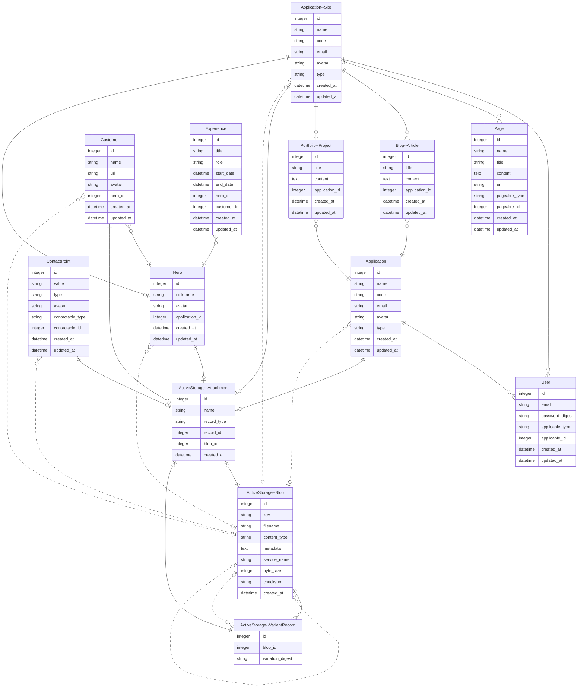

# Boilerplate Models

```mermaid
erDiagram
    %% --------------------------------------------------------
    %% Generated by "Rails Mermaid ERD"
    %% https://github.com/koedame/rails-mermaid_erd
    %% Restore Hash: #eyJzZWxlY3RNb2RlbHMiOlsiQWN0aXZlU3RvcmFnZTo6QXR0YWNobWVudCIsIkFjdGl2ZVN0b3JhZ2U6OkJsb2IiLCJBY3RpdmVTdG9yYWdlOjpWYXJpYW50UmVjb3JkIiwiQXBwbGljYXRpb24iLCJBcHBsaWNhdGlvbjo6U2l0ZSIsIkJsb2c6OkFydGljbGUiLCJDb250YWN0UG9pbnQiLCJDdXN0b21lciIsIkV4cGVyaWVuY2UiLCJIZXJvIiwiUGFnZSIsIlBvcnRmb2xpbzo6UHJvamVjdCIsIlVzZXIiXSwiaXNQcmV2aWV3UmVsYXRpb25zIjpmYWxzZSwiaXNTaG93UmVsYXRpb25Db21tZW50IjpmYWxzZSwiaXNTaG93S2V5IjpmYWxzZSwiaXNTaG93Q29tbWVudCI6ZmFsc2UsImlzSGlkZUNvbHVtbnMiOmZhbHNlfQ==
    %% --------------------------------------------------------

    %% table name: active_storage_attachments
    %% table comment:
    ActiveStorage--Attachment {
        integer id
        string name
        string record_type
        integer record_id
        integer blob_id
        datetime created_at
    }

    %% table name: active_storage_blobs
    %% table comment:
    ActiveStorage--Blob {
        integer id
        string key
        string filename
        string content_type
        text metadata
        string service_name
        integer byte_size
        string checksum
        datetime created_at
    }

    %% table name: active_storage_variant_records
    %% table comment:
    ActiveStorage--VariantRecord {
        integer id
        integer blob_id
        string variation_digest
    }

    %% table name: applications
    %% table comment:
    Application {
        integer id
        string name
        string code
        string email
        string avatar
        string type
        datetime created_at
        datetime updated_at
    }

    %% table name: applications
    %% table comment:
    Application--Site {
        integer id
        string name
        string code
        string email
        string avatar
        string type
        datetime created_at
        datetime updated_at
    }

    %% table name: blog_articles
    %% table comment:
    Blog--Article {
        integer id
        string title
        text content
        integer application_id
        datetime created_at
        datetime updated_at
    }

    %% table name: contact_points
    %% table comment:
    ContactPoint {
        integer id
        string value
        string type
        string avatar
        string contactable_type
        integer contactable_id
        datetime created_at
        datetime updated_at
    }

    %% table name: customers
    %% table comment:
    Customer {
        integer id
        string name
        string url
        string avatar
        integer hero_id
        datetime created_at
        datetime updated_at
    }

    %% table name: experiences
    %% table comment:
    Experience {
        integer id
        string title
        string role
        datetime start_date
        datetime end_date
        integer hero_id
        integer customer_id
        datetime created_at
        datetime updated_at
    }

    %% table name: heroes
    %% table comment:
    Hero {
        integer id
        string nickname
        string avatar
        integer application_id
        datetime created_at
        datetime updated_at
    }

    %% table name: pages
    %% table comment:
    Page {
        integer id
        string name
        string title
        text content
        string url
        string pageable_type
        integer pageable_id
        datetime created_at
        datetime updated_at
    }

    %% table name: portfolio_projects
    %% table comment:
    Portfolio--Project {
        integer id
        string title
        text content
        integer application_id
        datetime created_at
        datetime updated_at
    }

    %% table name: users
    %% table comment:
    User {
        integer id
        string email
        string password_digest
        string applicable_type
        integer applicable_id
        datetime created_at
        datetime updated_at
    }

    ActiveStorage--Attachment |o--|| ActiveStorage--Blob : ""
    ActiveStorage--Blob ||--o{ ActiveStorage--VariantRecord : ""
    ActiveStorage--Blob }o..o| ActiveStorage--Blob : ""
    ActiveStorage--VariantRecord ||--o| ActiveStorage--Attachment : ""
    ActiveStorage--VariantRecord }o..o| ActiveStorage--Blob : ""
    Application ||--o{ User : ""
    Application ||--o| ActiveStorage--Attachment : ""
    Application }o..o| ActiveStorage--Blob : ""
    Application--Site ||--o{ User : ""
    Application--Site ||--o{ Page : ""
    Application--Site ||--o{ Blog--Article : ""
    Application--Site ||--o{ Portfolio--Project : ""
    Application--Site ||--o| ActiveStorage--Attachment : ""
    Application--Site }o..o| ActiveStorage--Blob : ""
    Application--Site ||--o| Hero : ""
    Blog--Article }o--|| Application : ""
    ContactPoint ||--o| ActiveStorage--Attachment : ""
    ContactPoint }o..o| ActiveStorage--Blob : ""
    Customer }o--|| Hero : ""
    Customer ||--o| ActiveStorage--Attachment : ""
    Customer }o..o| ActiveStorage--Blob : ""
    Experience }o--|| Hero : ""
    Hero ||--o| ActiveStorage--Attachment : ""
    Hero }o..o| ActiveStorage--Blob : ""
    Portfolio--Project }o--|| Application : ""
```